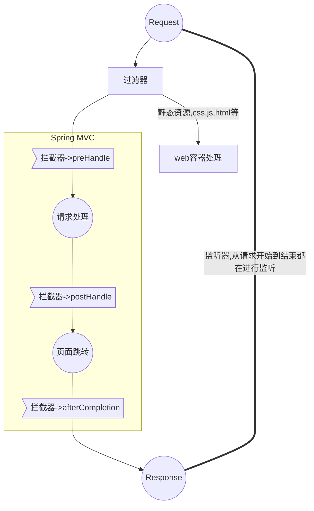
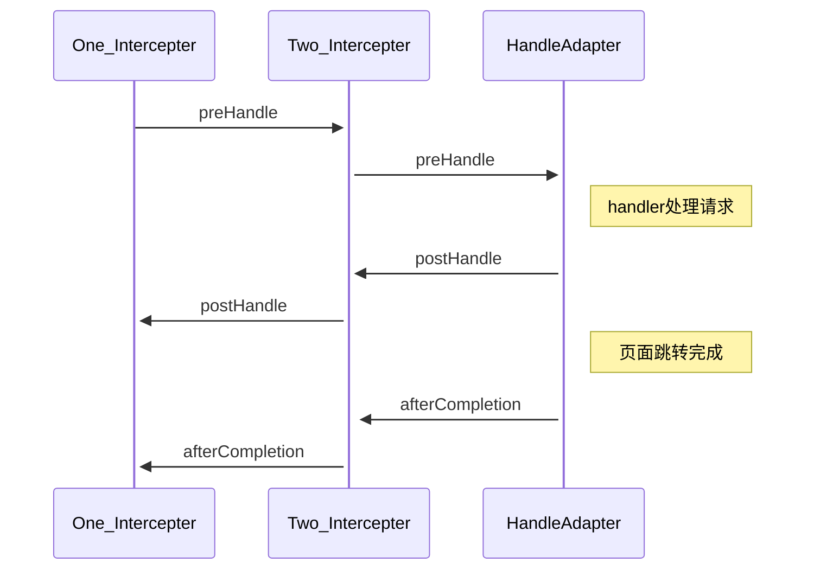

### 模块三

#### 一、任务一

##### 1 经点三层与MVC模式

经典三层代码架构（Controller，Service，Dao）

1. 表现层：View(视图)+Controller
2. 业务层：Service
3. 持久层：Dao 

MVC模式（模型-视图-控制器模式）（代码的组织方式/形式）

1. M：Model模型(数据模型[pojo、vo、po]+业务模型[业务逻辑])
2. V：View视图 (jsp，html)
3. C：Controller控制器（servlet）

Spring Framework在经典三层代码架构都有使用到，但是**Spring MVC框架是一个应用于表现层框架**。

##### 2 Spring MVC与原生servlet

1. 共同点：都是为了1)接收请求2)返回结果，跳转页面
2. 区别：
   1. SpringMVC全局只有一个Servlet来统领所有请求，将接收到的请求派发到下游的控制器中。
   2. Servlet每个前端请求都对应了一个Servlet。

##### 3 Spring MVC九大组件（★核心组件）

| 组件                            | 功能                                                         |
| :------------------------------ | ------------------------------------------------------------ |
| ★HandlerMapping（处理器映射器） | HandlerMapping 是⽤来查找 Handler 的，也就是处理器，具体的表现形式可以是类，也可以是⽅法。⽐如，标注了@RequestMapping的每个⽅法都可以看成是⼀个Handler。Handler负责具体实际的请求处理，在请求到达后，HandlerMapping 的作⽤便是找到请求相应的处理器Handler 和 Interceptor. |
| ★HandlerAdapter（处理器适配器） | HandlerAdapter 是⼀个适配器。因为 Spring MVC 中 Handler 可以是任意形式的，只要能处理请求即可。但是把请求交给 Servlet 的时候，由于 Servlet 的⽅法结构都是doService(HttpServletRequest req,HttpServletResponse resp)形式的，要让固定的 Servlet 处理⽅法调⽤ Handler 来进⾏处理，便是 HandlerAdapter 的职责。 |
| HandlerExceptionResolver        | HandlerExceptionResolver ⽤于处理 Handler 产⽣的异常情况。它的作⽤是根据异常设置ModelAndView，之后交给渲染⽅法进⾏渲染，渲染⽅法会将 ModelAndView 渲染成⻚⾯。 |
| ★ViewResolver                   | ViewResolver即视图解析器，⽤于将String类型的视图名和Locale解析为View类型的视图，只有⼀个resolveViewName()⽅法。从⽅法的定义可以看出，Controller层返回的String类型视图名viewName 最终会在这⾥被解析成为View。View是⽤来渲染⻚⾯的，也就是说，它会将程序返回的参数和数据填⼊模板中，⽣成html⽂件。ViewResolver 在这个过程主要完成两件事情：ViewResolver 找到渲染所⽤的模板（第⼀件⼤事）和所⽤的技术（第⼆件⼤事，其实也就是找到视图的类型，如JSP）并填⼊参数。默认情况下，Spring MVC会⾃动为我们配置⼀个InternalResourceViewResolver,是针对 JSP 类型视图的。 |
| RequestToViewNameTranslator     | RequestToViewNameTranslator 组件的作⽤是从请求中获取 ViewName.因为 ViewResolver 根据ViewName 查找 View，但有的 Handler 处理完成之后,没有设置 View，也没有设置 ViewName，便要通过这个组件从请求中查找 ViewName。 |
| LocaleResolver                  | ViewResolver 组件的 resolveViewName ⽅法需要两个参数，⼀个是视图名，⼀个是 Locale。LocaleResolver ⽤于从请求中解析出 Locale，⽐如中国 Locale 是 zh-CN，⽤来表示⼀个区域。这个组件也是 i18n 的基础。 |
| ThemeResolver                   | ThemeResolver 组件是⽤来解析主题的。主题是样式、图⽚及它们所形成的显示效果的集合。Spring MVC 中⼀套主题对应⼀个 properties⽂件，⾥⾯存放着与当前主题相关的所有资源，如图⽚、CSS样式等。创建主题⾮常简单，只需准备好资源，然后新建⼀个“主题名.properties”并将资源设置进去，放在classpath下，之后便可以在⻚⾯中使⽤了。SpringMVC中与主题相关的类有ThemeResolver、ThemeSource和Theme。ThemeResolver负责从请求中解析出主题名，ThemeSource根据主题名找到具体的主题，其抽象也就是Theme，可以通过Theme来获取主题和具体的资源。 |
| MultipartResolver               | MultipartResolver ⽤于上传请求，通过将普通的请求包装成 MultipartHttpServletRequest 来实现。MultipartHttpServletRequest 可以通过 getFile() ⽅法 直接获得⽂件。如果上传多个⽂件，还可以调⽤ getFileMap()⽅法得到Map<FileName，File>这样的结构，MultipartResolver 的作⽤就是封装普通的请求，使其拥有⽂件上传的功能。 |
| FlashMapManager                 | FlashMap ⽤于重定向时的参数传递，⽐如在处理⽤户订单时候，为了避免重复提交，可以处理完post请求之后重定向到⼀个get请求，这个get请求可以⽤来显示订单详情之类的信息。这样做虽然可以规避⽤户重新提交订单的问题，但是在这个⻚⾯上要显示订单的信息，这些数据从哪⾥来获得呢？因为重定向时么有传递参数这⼀功能的，如果不想把参数写进URL（不推荐），那么就可以通过FlashMap来传递。只需要在重定向之前将要传递的数据写⼊请求（可以通过ServletRequestAttributes.getRequest()⽅法获得）的属性OUTPUT_FLASH_MAP_ATTRIBUTE中，这样在重定向之后的Handler中Spring就会⾃动将其设置到Model中，在显示订单信息的⻚⾯上就可以直接从Model中获取数据。FlashMapManager 就是⽤来管理 FalshMap 的。 |

##### 4 url-pattern标签

<url-pattern></url-pattern>用来拦截访问连接，决定哪些连接会被Spring MVC处理。

1. 带后缀，比如\*.do,\*.action,\*.aaa。

2. /，拦截所有，除了.jsp。会拦截html等所有静态资源。

   原因:因为Tomcat中有一个web.xml（父），我们项目中也有一个web.xml（子），他们是父子级关系。

   tomcat配置的拦截会默认过滤跳jsp。

       <!-- The mapping for the default servlet -->
       <servlet-mapping>
           <servlet-name>default</servlet-name>
           <url-pattern>/</url-pattern>
       </servlet-mapping>
       
       <!-- The mappings for the JSP servlet -->
       <servlet-mapping>
           <servlet-name>jsp</servlet-name>
           <url-pattern>*.jsp</url-pattern>
           <url-pattern>*.jspx</url-pattern>
       </servlet-mapping>

   解决：

   1. 使用\<mvc:defult-servlet-handler/\>

   ​		他会定义一个DefaultServletHttpRequestHandler对象，他会检查所有进入DispatcherServlet的连接，如果发现是静态资源，他就会将该请求交给tomcat的默认DefaultServlet来处理。

   2. （常用）使用\<mvc:resources location="classpath:/" mapping="/resource/**"/\>，该方案，是将静态资源完全交给自己处理。
      1. location：指定静态资源的路径，classpath:/,D:/data/等。
      2. mapping：静态资源被映射的url路径。/resource/**。

3. /\*，拦截所有，包含了.jsp。

##### 5 Map，Model，ModelMap

但在Handler的参数中直接声明形参Map，Model，ModelMap其一的时候，直接使用他们来进行数据封装。最终都能将数据成功渲染在界面上。

1. Map：java.util.Map
2. Model：org.springframework.ui.Model
3. ModelMap：org.springframework.ui.ModelMap

原因：在封装返回的时候，都使用到了Model的实现类型，而这些实现类，都继承了ModelMap，而ModelMap又是Map的实现类。


##### 6 日期类型的参数绑定

前端传入的文本（http超文本协议传输的都是文本），无法直接直接转换成Date对象。此时需要使用到Converter，实现一个对特定类型转换为特定类型的转换器。

1. 继承Converter<S,T>，S表示source，源类型；T表示Target，目标类型。

2. 然后注册到Spring MVC中去。

   ```
   <!--
       自动注册最合适的处理器映射器，处理器适配器(调用handler方法)
   -->
   <mvc:annotation-driven conversion-service="conversionServiceBean"/>
   
   
   <!--注册自定义类型转换器-->
   <bean id="conversionServiceBean" class="org.springframework.format.support.FormattingConversionServiceFactoryBean">
       <property name="converters">
           <set>
               <bean class="com.lagou.edu.converter.DateConverter"></bean>
           </set>
       </property>
   </bean>
   ```

##### 7 Rest风格的支持

1. @RequestMapping(value = "/test/{id}/info",method = RequestMethod.GET)
   1. value中的参数需要使用{参数名}来标记。
   2. method用来指定该请求的动作。虽然可以统一POST，但是还是希望按照规范来。
2. @PathVariable，用来标记该参数匹配RequestMapping中的哪一个值。
   1. value，默认为空，为空的时候会默认取参数名。

##### 7 JSON数据的交互

1. 接收Json形式的形参需要被@RequestBody标记，且只能有一个。
2. 返回Json形式的数据需要@ResponseBody标记Handler方法。
3. 如果前端需要以Json的方式传输数据，那么header中的contentType取值应该：application/Json

##### 8 过滤器、监听器、拦截器

1. 过滤器（filter）,在Servlet之前起作用，对Request进行过滤，比如配置为*/*过滤静态资源js，html，css。
2. 监听器（Listener）,实现了javax.servlet.ServletContextListener的组件，需要在web.xml注册，随着web容器 的启动而初始化，且只会初始化一次，销毁一次。
   1. 可以用来做初始化工作，例如：Spring容器的启动。
   2. 监听特定事件。
3. 拦截器（Intercepter）,属于Spring MVC自身的组件。只会拦截会进入handler的请求，实现HandlerInterceptor 的接口。
   1. 进入handler前拦截一次（preHandle）。
   2. 控制器方法调用完成之后，页面跳转之前。（postHandle）。
   3. 跳转完成之后拦截一次（afterCompletion）。
4. 过滤器、监听器、拦截器执行顺序。

5. 多拦截器(Intercepter)处理顺序

6. 异常捕获机制
   1. ExceptionHandler(Exception.class)用来标记**方法**会接收他所在的Handler抛出的错误。Exception用来指定需要处理那种类型的错误。
   2. 结合ControllerAdvice类注解可以让ExceptionHandler标记的方法处理所有Handler的错误。

##### 二、任务三

###### 1 DispatcherServlet继承关系


